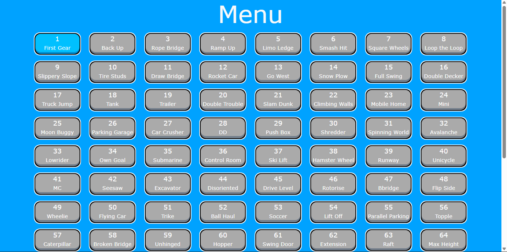
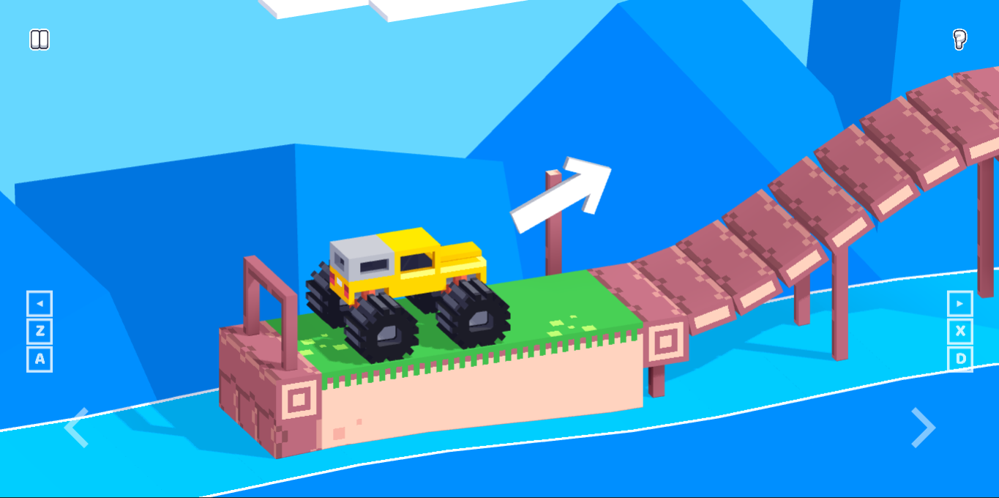

# Drive Mad Game

A fun level-based driving game built with HTML, CSS, and JavaScript.  
Your goal is simple: control the vehicle, cross tricky obstacles, and reach the finish line without flipping over.

## Screenshots
(Add your GitHub image links here)

### Menu

### Gameplay

### Level Complete

## Features
- Smooth controls  
- Bright and clean visuals  
- Multiple levels  
- Runs directly in the browser  
- Lightweight and responsive  

## Controls
- **A / Left Arrow** – Reverse  
- **D / Right Arrow** – Accelerate  
- **Z / X** – Tilt balance  

## Tech Stack
- HTML  
- CSS  
- JavaScript  

## How to Play
1. Open `index.html` in your browser  
2. Select a level  
3. Drive the vehicle through obstacles  
4. Reach the end platform to complete the level  

## Project Goal
The project focuses on improving game physics, UI interaction, and animation handling using pure JavaScript.

